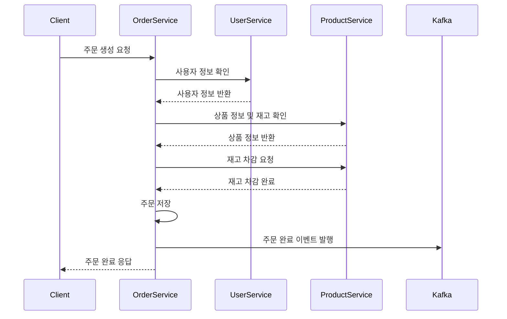

# 📋 Order Service

주문 처리, 서비스 간 통신, 이벤트 발행을 담당하는 마이크로서비스입니다.

## 🚀 빠른 시작

### 사전 요구사항
```bash
# PostgreSQL 실행
docker run -d --name order-db \
  -e POSTGRES_DB=ecommerce_order \
  -e POSTGRES_USER=postgres \
  -e POSTGRES_PASSWORD=postgres \
  -p 5432:5432 postgres:15

# Kafka 실행 (이벤트용 - 선택사항)
docker run -d --name order-kafka \
  -p 9092:9092 \
  -e KAFKA_ZOOKEEPER_CONNECT=zookeeper:2181 \
  confluentinc/cp-kafka:latest
```

### 개별 실행
```bash
cd order-service

# 전체 MSA 환경에서 실행 (권장)
gradlew.bat bootRun

# 독립 실행 (외부 서비스 Mock)
gradlew.bat bootRun --args="--spring.profiles.active=standalone"
```

## 📋 주요 기능

- 📝 주문 생성 및 관리
- 🔄 서비스 간 통신 (User, Product Service)
- ⚡ Circuit Breaker 기반 장애 격리
- 📢 Kafka 이벤트 발행
- 🔁 재고 관리 연동
- 📊 주문 상태 추적

## 🛠️ API 엔드포인트

```bash
# 주문 생성
POST /orders
{
  "userId": 1,
  "orderItems": [
    {
      "productId": 1,
      "quantity": 2
    }
  ],
  "shippingAddress": {
    "zipCode": "12345",
    "address": "서울시 강남구 테헤란로 123",
    "detailAddress": "456호",
    "recipientName": "홍길동",
    "recipientPhone": "010-1234-5678"
  }
}

# 주문 조회
GET /orders/{orderId}

# 사용자별 주문 목록
GET /orders/user/{userId}?page=0&size=10

# 주문 상태별 조회
GET /orders/status/PENDING

# 주문 상태 변경
PUT /orders/{orderId}/status
{
  "status": "CONFIRMED"
}

# 주문 취소
DELETE /orders/{orderId}
```

## ⚙️ 설정

- **포트**: 8083
- **데이터베이스**: PostgreSQL (ecommerce_order)
- **이벤트**: Kafka (선택사항)
- **외부 서비스**: User Service, Product Service

## 🔧 환경변수

```bash
# 데이터베이스
SPRING_DATASOURCE_URL=jdbc:postgresql://localhost:5432/ecommerce_order
SPRING_DATASOURCE_USERNAME=postgres
SPRING_DATASOURCE_PASSWORD=postgres

# Kafka (선택사항)
SPRING_KAFKA_BOOTSTRAP_SERVERS=localhost:9092

# 외부 서비스 (Eureka 사용 시 자동 발견)
USER_SERVICE_URL=http://localhost:8081
PRODUCT_SERVICE_URL=http://localhost:8082

# Circuit Breaker
CIRCUIT_BREAKER_FAILURE_RATE_THRESHOLD=50
CIRCUIT_BREAKER_WAIT_DURATION=5s
```

## 🏗️ 서비스 간 통신

### Feign Client 사용
```java
@FeignClient(name = "user-service", fallback = UserServiceClientFallback.class)
public interface UserServiceClient {
    @GetMapping("/users/{userId}")
    UserResponse getUserById(@PathVariable Long userId);
}
```

### Circuit Breaker 패턴
```java
@CircuitBreaker(name = "user-service", fallbackMethod = "fallbackGetUser")
@Retry(name = "user-service")
public CompletableFuture<UserResponse> getUserAsync(Long userId) {
    return CompletableFuture.supplyAsync(() -> userServiceClient.getUserById(userId));
}
```

## 📢 이벤트 발행

```java
// 주문 생성 이벤트
OrderEvent event = OrderEvent.builder()
    .eventType("ORDER_CREATED")
    .orderId(order.getOrderId())
    .userId(order.getUserId())
    .totalAmount(order.getTotalAmount())
    .build();

kafkaTemplate.send("order.events", event);
```

## 🧪 테스트 시나리오

### 독립 테스트
```bash
# 1. Mock 데이터로 테스트
gradlew.bat test

# 2. 독립 실행으로 API 테스트
gradlew.bat bootRun --args="--spring.profiles.active=standalone"

# 3. 주문 생성 테스트 (외부 서비스 Mock)
curl -X POST http://localhost:8083/orders \
  -H "Content-Type: application/json" \
  -d '{"userId":1,"orderItems":[{"productId":1,"quantity":2}],...}'
```

### 통합 테스트
```bash
# 1. 필요한 서비스들 실행
# Terminal 1: cd user-service && gradlew.bat bootRun
# Terminal 2: cd product-service && gradlew.bat bootRun
# Terminal 3: cd order-service && gradlew.bat bootRun

# 2. 실제 주문 플로우 테스트
# 사용자 생성 → 상품 생성 → 주문 생성
```

## 🔄 주문 플로우



## 🚨 장애 시나리오

### User Service 장애
```bash
# Circuit Breaker가 열린 상태에서 Fallback 응답
{
  "userId": 1,
  "name": "사용자 정보 조회 실패",
  "available": false
}
```

### Product Service 장애
```bash
# 재고 부족 또는 서비스 장애 시
{
  "error": "상품 정보를 확인할 수 없습니다",
  "fallback": true
}
```
