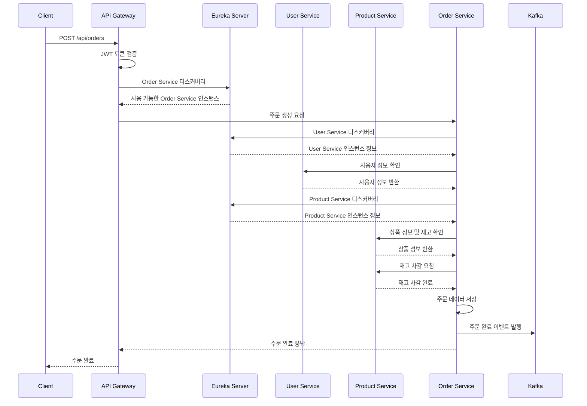

# 🛒 MSA E-Commerce Platform

> **Spring Boot 기반 마이크로서비스 아키텍처로 구현한 이커머스 플랫폼**  
> 포트폴리오용 프로젝트로 실무급 MSA 설계 및 구현 역량을 보여줍니다.

[](https://openjdk.java.net/projects/jdk/17/)
[](https://spring.io/projects/spring-boot)
[](https://docs.docker.com/compose/)
[](https://opensource.org/licenses/MIT)

## 🎯 프로젝트 목표

**실무급 마이크로서비스 아키텍처 설계 및 구현**을 통해 다음 역량을 입증합니다:

- **마이크로서비스 아키텍처** 설계 및 구현
- **서비스 디스커버리** 및 동적 로드밸런싱
- **분산 시스템**에서의 서비스 간 통신 패턴
- **장애 격리 및 복구** 메커니즘 구현
- **이벤트 드리븐 아키텍처** 설계
- **Docker 기반 컨테이너** 오케스트레이션
- **실무급 개발/운영 환경** 구축

## 🏗️ 시스템 아키텍처

```
┌─────────────────────────────────────────────────────────────────┐
│                          Client                                 │
│                    (Web / Mobile)                               │
└─────────────────────┬───────────────────────────────────────────┘
                      │ HTTPS/REST
┌─────────────────────▼───────────────────────────────────────────┐
│                   API Gateway                                   │
│                  (Port: 8080)                                   │
│                                                                 │
│  🔐 JWT 인증/인가    🔄 로드밸런싱    ⚡ Rate Limiting          │
│  🛡️ CORS 처리       📊 요청 라우팅   📝 로깅                   │
└─────────────────────┬───────────────────────────────────────────┘
                      │ Service Discovery
┌─────────────────────▼───────────────────────────────────────────┐
│               Eureka Server                                     │
│                (Port: 8761)                                     │
│                                                                 │
│  📋 Service Registry & Discovery                                │
│  • 서비스 등록/해제 자동화                                       │
│  • 헬스체크 및 장애 감지                                         │
│  • 동적 로드밸런싱                                               │
└─────────────────────┬───────────────────────────────────────────┘
                      │ (Dynamic Service Discovery)
      ┌───────────────┼───────────────┐
      │               │               │
┌─────▼──────┐ ┌────────▼──────┐ ┌────────▼──────────┐
│User Service│ │Product Service│ │   Order Service   │
│            │ │               │ │                   │
│[Instance 1]│ │[Instance 1]   │ │  [Instance 1]     │
│[Instance 2]│ │[Instance 2]   │ │  [Instance 2]     │
│            │ │               │ │  [Instance 3]     │
├────────────┤ ├───────────────┤ ├───────────────────┤
│• 회원 관리  │ │• 상품 관리     │ │• 주문 처리         │
│• JWT 인증  │ │• 상품 검색     │ │• 서비스 간 통신    │
│• 프로필 관리│ │• 재고 관리     │ │• 주문 상태 관리    │
│• 권한 관리  │ │• 카테고리 관리 │ │• SAGA 트랜잭션    │
└─────┬──────┘ └───────┬───────┘ └─────────┬─────────┘
      │                │                   │
┌─────▼─────────────────▼─────────────────▼───────────────────────┐
│                    Infrastructure                               │
│  PostgreSQL  │   Redis   │   Kafka   │
│   (분산DB)   │ (캐시/세션)│ (이벤트)  │
└─────────────────────────────────────────────────────────────────┘
```

## 🛠️ 기술 스택

### Backend Framework
- **Java 17** - LTS 버전으로 안정성과 성능 확보
- **Spring Boot 3.2** - 최신 프레임워크 및 자동 구성
- **Spring Cloud 2023.0** - 마이크로서비스 생태계

### MSA Core
- **Spring Cloud Netflix Eureka** - 서비스 디스커버리 및 등록
- **Spring Cloud Gateway** - API Gateway 및 라우팅
- **Spring Cloud OpenFeign** - 선언적 REST 클라이언트
- **Resilience4j** - Circuit Breaker, Retry, Rate Limiter

### Security & Authentication
- **Spring Security 6** - 인증/인가 프레임워크
- **JWT (JSON Web Token)** - Stateless 토큰 기반 인증

### Data Management
- **Spring Data JPA** - ORM 및 리포지토리 패턴
- **PostgreSQL 15** - 관계형 데이터베이스 (서비스별 독립 스키마)
- **Redis 7** - 인메모리 캐시 및 세션 저장소

### Messaging & Events
- **Apache Kafka** - 분산 스트리밍 플랫폼
- **Spring Kafka** - Kafka 통합 및 이벤트 처리

### Infrastructure & DevOps
- **Docker & Docker Compose** - 컨테이너화 및 오케스트레이션
- **Gradle 8** - 빌드 도구 및 의존성 관리
- **Spring Boot Actuator** - 모니터링, 헬스체크, 메트릭

## 📁 프로젝트 구조

```
ecommerce-msa-platform/
├── docker-compose.yml              # 전체 서비스 오케스트레이션
├── docker-compose.dev.yml          # 개발환경용 (인프라만)
├── docker-compose.prod.yml         # 프로덕션용 (다중 인스턴스)
├── README.md                       # 프로젝트 설명서
├── scripts/
│   ├── build-all.sh               # 전체 빌드 스크립트
│   ├── build-single.sh            # 개별 서비스 빌드
│   ├── scale-services.sh          # 서비스 스케일링
│   ├── health-check.sh            # 전체 서비스 헬스체크
│   └── load-test.sh               # 성능 테스트 실행
├── eureka-server/                 # 서비스 디스커버리
│   ├── src/main/java/
│   ├── build.gradle
│   ├── Dockerfile
│   └── README.md
├── api-gateway/                   # API Gateway 서비스
│   ├── src/main/java/
│   ├── build.gradle
│   ├── Dockerfile
│   └── README.md
├── user-service/                  # 사용자 관리 서비스
│   ├── src/main/java/
│   ├── build.gradle
│   ├── Dockerfile
│   └── README.md
├── product-service/               # 상품 관리 서비스
│   ├── src/main/java/
│   ├── build.gradle
│   ├── Dockerfile
│   └── README.md
├── order-service/                 # 주문 처리 서비스
│   ├── src/main/java/
│   ├── build.gradle
│   ├── Dockerfile
│   └── README.md
└── infrastructure/
    ├── postgres/
    │   └── init-scripts/          # DB 초기화 스크립트
    ├── redis/
    └── kafka/
```

## 🚀 Quick Start

### 1. 사전 요구사항
- Java 17+
- Docker & Docker Compose
- Git
- 최소 메모리: 8GB RAM 권장

### 2. 전체 시스템 실행
```bash
# 프로젝트 클론
git clone https://github.com/yourusername/ecommerce-msa-platform.git
cd ecommerce-msa-platform

# 전체 시스템 빌드 및 실행
./scripts/build-all.sh
docker-compose up --build

# 백그라운드 실행 (다중 인스턴스)
docker-compose -f docker-compose.prod.yml up -d --build
```

### 3. 서비스 접근 URL
- **Eureka Dashboard**: http://localhost:8761
- **API Gateway**: http://localhost:8080
- **User Service**: http://localhost:8081 (직접 접근 비권장)
- **Product Service**: http://localhost:8082 (직접 접근 비권장)
- **Order Service**: http://localhost:8083 (직접 접근 비권장)

### 4. 서비스 헬스체크
```bash
# 스크립트로 전체 서비스 상태 확인
./scripts/health-check.sh

# 개별 서비스 상태 확인
curl http://localhost:8080/actuator/health  # API Gateway
curl http://localhost:8761/actuator/health  # Eureka Server

# Eureka에 등록된 서비스 목록 확인
curl http://localhost:8761/eureka/apps
```

### 5. 서비스 스케일링 테스트
```bash
# Order Service 3개 인스턴스로 확장
docker-compose up --scale order-service=3 -d

# Eureka 대시보드에서 인스턴스 확인
open http://localhost:8761
```

## 📊 핵심 비즈니스 플로우

### 주문 처리 플로우


## 🔧 MSA 핵심 패턴 구현

### 1. 서비스 디스커버리 패턴
```java
// Eureka 클라이언트 자동 등록
@SpringBootApplication
@EnableEurekaClient
@EnableFeignClients
public class OrderServiceApplication {
    public static void main(String[] args) {
        SpringApplication.run(OrderServiceApplication.class, args);
    }
}

// 서비스 이름으로 통신 (URL 하드코딩 불필요)
@FeignClient(name = "user-service")
public interface UserServiceClient {
    @GetMapping("/api/users/{userId}")
    UserResponse getUser(@PathVariable Long userId);
}
```

### 2. Circuit Breaker 패턴
```java
@Component
public class OrderService {
    
    // 외부 서비스 장애 시 격리 및 Fallback
    @CircuitBreaker(name = "user-service", fallbackMethod = "fallbackGetUser")
    @TimeLimiter(name = "user-service")
    @Retry(name = "user-service")
    public CompletableFuture<UserResponse> getUserAsync(Long userId) {
        return CompletableFuture.supplyAsync(() -> 
            userServiceClient.getUser(userId));
    }
    
    // Fallback 메서드 - 장애 시 기본값 반환
    public CompletableFuture<UserResponse> fallbackGetUser(Long userId, Exception ex) {
        return CompletableFuture.completedFuture(
            UserResponse.builder()
                .userId(userId)
                .name("사용자 정보 조회 실패")
                .available(false)
                .build()
        );
    }
}
```

### 3. 이벤트 드리븐 아키텍처
```java
// 주문 완료 후 비동기 이벤트 발행
@Service
@Transactional
public class OrderService {
    
    @Autowired
    private KafkaTemplate<String, Object> kafkaTemplate;
    
    public Order createOrder(CreateOrderRequest request) {
        // 1. 주문 처리 로직
        Order order = processOrder(request);
        
        // 2. 데이터베이스 저장
        Order savedOrder = orderRepository.save(order);
        
        // 3. 비동기 이벤트 발행
        OrderCreatedEvent event = OrderCreatedEvent.builder()
            .orderId(savedOrder.getOrderId())
            .userId(savedOrder.getUserId())
            .productId(savedOrder.getProductId())
            .quantity(savedOrder.getQuantity())
            .build();
            
        kafkaTemplate.send("order.created", event);
        
        return savedOrder;
    }
}

// 다른 서비스에서 이벤트 구독
@KafkaListener(topics = "order.created")
public void handleOrderCreated(OrderCreatedEvent event) {
    // 재고 업데이트, 알림 발송 등 처리
}
```

### 4. 분산 데이터 관리
```yaml
# 각 서비스별 독립적인 데이터베이스 스키마
user-service:
  database: ecommerce_user
  tables: users, user_profiles

product-service:
  database: ecommerce_product
  tables: products, categories, inventory

order-service:
  database: ecommerce_order
  tables: orders, order_items, order_status
```

## 🚀 API 사용 예시

### 1. 사용자 회원가입
```bash
curl -X POST http://localhost:8080/api/users/register \
  -H "Content-Type: application/json" \
  -d '{
    "email": "user@example.com",
    "password": "password123",
    "name": "홍길동",
    "phoneNumber": "010-1234-5678"
  }'
```

### 2. 로그인 (JWT 토큰 발급)
```bash
curl -X POST http://localhost:8080/api/users/login \
  -H "Content-Type: application/json" \
  -d '{
    "email": "user@example.com",
    "password": "password123"
  }'
```

### 3. 상품 조회
```bash
# 상품 목록 조회 (페이징)
curl "http://localhost:8080/api/products?page=0&size=10&sort=createdAt,desc"

# 상품 검색 (Elasticsearch)
curl "http://localhost:8080/api/products/search?keyword=스마트폰&category=전자제품"

# 특정 상품 상세 조회
curl http://localhost:8080/api/products/1
```

### 4. 주문 생성
```bash
curl -X POST http://localhost:8080/api/orders \
  -H "Content-Type: application/json" \
  -H "Authorization: Bearer YOUR_JWT_TOKEN" \
  -d '{
    "productId": 1,
    "quantity": 2,
    "shippingAddress": {
      "zipCode": "12345",
      "address": "서울시 강남구 테헤란로 123",
      "detailAddress": "456호"
    }
  }'
```

## 🔧 개발 환경 설정

### 로컬 개발 모드
```bash
# 1. 인프라스트럭처만 실행 (개발용)
docker-compose -f docker-compose.dev.yml up -d

# 2. 개별 서비스 로컬 실행
# Terminal 1: Eureka Server
cd eureka-server && ./gradlew bootRun

# Terminal 2: User Service
cd user-service && ./gradlew bootRun

# Terminal 3: Product Service
cd product-service && ./gradlew bootRun

# Terminal 4: Order Service
cd order-service && ./gradlew bootRun

# Terminal 5: API Gateway
cd api-gateway && ./gradlew bootRun
```

### 부분 서비스 재배포
```bash
# 특정 서비스만 수정 후 재배포
./scripts/build-single.sh order-service

# 또는 수동 재배포
cd order-service
./gradlew bootBuildImage --imageName=order-service:latest
docker-compose up -d --no-deps order-service
```

## 📊 성능 최적화 및 모니터링

### 캐싱 전략
```java
// Redis를 활용한 상품 정보 캐싱
@Cacheable(value = "products", key = "#productId")
public ProductResponse getProduct(Long productId) {
    // DB 조회 로직
}

@CacheEvict(value = "products", key = "#product.productId")
public Product updateProduct(Product product) {
    // 상품 업데이트 시 캐시 무효화
}
```

### 데이터베이스 최적화
```sql
-- 주요 인덱스 설정
CREATE INDEX idx_orders_user_id ON orders(user_id);
CREATE INDEX idx_orders_created_at ON orders(created_at DESC);
CREATE INDEX idx_products_category ON products(category_id);
CREATE INDEX idx_products_name_search ON products USING GIN(to_tsvector('korean', name));
```

## 🧪 테스트 전략

### 단위 테스트
```bash
# 전체 서비스 테스트
./gradlew test

# 특정 서비스 테스트
cd order-service
./gradlew test
```

### 통합 테스트
```java
@SpringBootTest
@Testcontainers
class OrderServiceIntegrationTest {
    
    @Container
    static PostgreSQLContainer<?> postgres = 
        new PostgreSQLContainer<>("postgres:15");
        
    @Test
    void 주문생성_통합테스트() {
        // Given, When, Then
    }
}
```

## 🚧 개발 로드맵

### Phase 1: 핵심 MSA 구조 (진행중) ✅
**기간**: 2개월 (예정)

**완료된 기능**:
- [ ] **Eureka Server** - 서비스 디스커버리 구현
- [ ] **API Gateway** - 통합 진입점 및 라우팅
- [ ] **User Service** - 사용자 관리 및 JWT 인증
- [ ] **Product Service** - 상품 관리 및 검색 (PostgreSQL Full-Text Search)
- [ ] **Order Service** - 주문 처리 및 서비스 간 통신
- [ ] **Circuit Breaker** - Resilience4j 기반 장애 격리
- [ ] **Event-Driven Architecture** - Kafka 기반 비동기 통신
- [ ] **Docker Compose** - 컨테이너 기반 통합 환경
- [ ] **Multi-Instance Deployment** - 서비스별 수평 확장

**기술적 성과**:
- ✅ 서비스별 독립적인 빌드/배포 환경 구축
- ✅ 동적 서비스 디스커버리 및 로드밸런싱
- ✅ 분산 시스템에서의 장애 격리 및 복구
- ✅ 이벤트 기반 비동기 처리 구현

### Phase 2: 고급 MSA 패턴 (진행 예정)
**기간**: 3개월 예정

- [ ] **Config Server** - 중앙집중식 설정 관리
- [ ] **Payment Service** - 결제 처리 서비스
- [ ] **Notification Service** - 알림 서비스
- [ ] **SAGA 패턴** - 분산 트랜잭션 관리
- [ ] **CQRS 패턴** - 명령과 조회 분리

### Phase 3: 운영 개선 (6개월 예정)
- [ ] **API Rate Limiting** - 서비스별 호출 제한
- [ ] **Distributed Tracing** - 분산 추적 (Sleuth + Zipkin)
- [ ] **ELK Stack** - 중앙집중식 로깅
- [ ] **Prometheus + Grafana** - 메트릭 수집 및 대시보드

### Phase 4: 클라우드 네이티브 (12개월 예정)
- [ ] **Kubernetes** - 컨테이너 오케스트레이션
- [ ] **Service Mesh (Istio)** - 서비스 간 통신 관리
- [ ] **GitOps (ArgoCD)** - 자동화된 배포
- [ ] **Auto Scaling** - HPA/VPA 기반 자동 스케일링

## 🎯 포트폴리오 핵심 어필 포인트

### 아키텍처 설계 역량
- **도메인 기반 서비스 분리**: 각 서비스가 명확한 책임과 경계를 가짐
- **서비스 디스커버리**: Eureka를 통한 동적 서비스 발견 및 로드밸런싱
- **느슨한 결합**: REST API와 이벤트 기반 통신으로 서비스 간 의존성 최소화
- **확장 가능한 구조**: 새로운 서비스 추가 시 기존 서비스에 영향 없음

### 실무 기술 적용
- **Circuit Breaker 패턴**: 외부 서비스 장애 시 격리 및 복구
- **이벤트 드리븐 아키텍처**: Kafka를 통한 비동기 처리
- **성능 최적화**: Redis 캐싱, DB 인덱싱, 비동기 처리
- **보안**: JWT 기반 인증/인가, API Gateway를 통한 통합 보안

### DevOps & 운영 역량
- **컨테이너화**: Docker 기반 일관된 개발/운영 환경
- **모니터링**: Actuator를 통한 헬스체크 및 메트릭 수집
- **로그 관리**: 구조화된 로깅 및 분산 시스템 추적
- **자동화**: 빌드/배포 스크립트를 통한 개발 효율성

### 확장성 & 성능 설계
- **수평 확장**: 각 서비스별 독립적인 스케일링
- **데이터베이스 분산**: 서비스별 독립적인 데이터 저장소
- **캐싱 전략**: 다층 캐싱을 통한 응답속도 향상
- **비동기 처리**: 이벤트 기반 비동기 통신으로 처리량 증대

## 📞 프로젝트 관련 문의

### GitHub Repository
- **Main Repository**: [ecommerce-msa-platform](https://github.com/ohuiseok/ecommerce-msa-platform)
- **API Documentation**: [Swagger UI](http://localhost:8080/swagger-ui.html) (로컬 실행 시)

---

## 🏆 프로젝트 요약

> **"실무에서 바로 적용 가능한 MSA 아키텍처 설계 및 구현 경험"**

이 프로젝트는 단순한 CRUD 애플리케이션이 아닌, **실제 운영 환경에서 고려해야 할 모든 요소들을 포함한 완성도 높은 마이크로서비스 플랫폼**입니다.

서비스 디스커버리부터 분산 트랜잭션 처리, 장애 복구, 성능 최적화까지 MSA의 핵심 패턴들을 실제로 구현하여 **기업 환경에서 요구하는 기술 역량**을 입증합니다.

**핵심 기술 키워드**: 
`Microservices Architecture` `Spring Boot` `Eureka` `API Gateway` `Circuit Breaker` `Docker` `Kafka` `Redis` `PostgreSQL` `Elasticsearch` `JWT` `Event-Driven Architecture` `SAGA Pattern` `Distributed Systems`