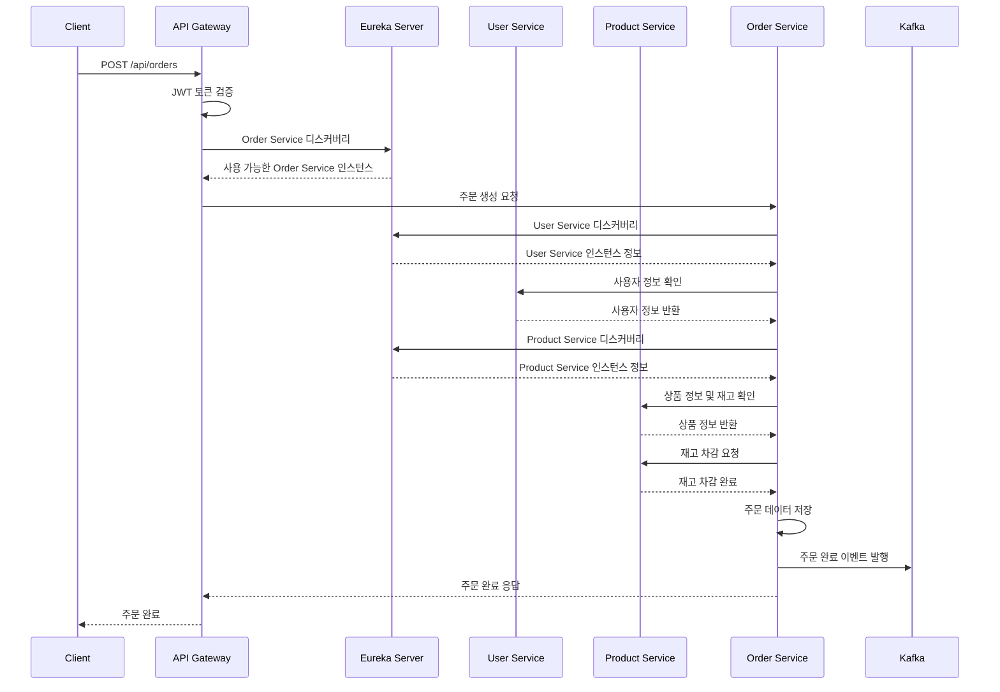

# 🛒 MSA E-Commerce Platform

> **Spring Boot 기반 마이크로서비스 아키텍처로 구현한 이커머스 플랫폼**  
> 포트폴리오용 프로젝트로 실무급 MSA 설계 및 구현 역량을 보여줍니다.

[](https://openjdk.java.net/projects/jdk/17/)
[](https://spring.io/projects/spring-boot)
[](https://docs.docker.com/compose/)
[](https://opensource.org/licenses/MIT)

## 🎯 프로젝트 목표

**실무급 마이크로서비스 아키텍처 설계 및 구현**을 통해 다음 역량을 입증합니다:

- **마이크로서비스 아키텍처** 설계 및 구현
- **서비스 디스커버리** 및 동적 로드밸런싱
- **분산 시스템**에서의 서비스 간 통신 패턴
- **장애 격리 및 복구** 메커니즘 구현
- **이벤트 드리븐 아키텍처** 설계
- **Docker 기반 컨테이너** 오케스트레이션
- **실무급 개발/운영 환경** 구축

## 🏗️ 시스템 아키텍처

```
┌─────────────────────────────────────────────────────────────────┐
│                          Client                                 │
│                    (Web / Mobile)                               │
└─────────────────────┬───────────────────────────────────────────┘
                      │ HTTPS/REST
┌─────────────────────▼───────────────────────────────────────────┐
│                   API Gateway                                   │
│                  (Port: 8080)                                   │
│                                                                 │
│  🔐 JWT 인증/인가    🔄 로드밸런싱    ⚡ Rate Limiting          │
│  🛡️ CORS 처리       📊 요청 라우팅   📝 로깅                   │
└─────────────────────┬───────────────────────────────────────────┘
                      │ Service Discovery
┌─────────────────────▼───────────────────────────────────────────┐
│               Eureka Server                                     │
│                (Port: 8761)                                     │
│                                                                 │
│  📋 Service Registry & Discovery                                │
│  • 서비스 등록/해제 자동화                                       │
│  • 헬스체크 및 장애 감지                                         │
│  • 동적 로드밸런싱                                               │
└─────────────────────┬───────────────────────────────────────────┘
                      │ (Dynamic Service Discovery)
      ┌───────────────┼───────────────┐
      │               │               │
┌─────▼──────┐ ┌────────▼──────┐ ┌────────▼──────────┐
│User Service│ │Product Service│ │   Order Service   │
│            │ │               │ │                   │
│[Instance 1]│ │[Instance 1]   │ │  [Instance 1]     │
│[Instance 2]│ │[Instance 2]   │ │  [Instance 2]     │
│            │ │               │ │  [Instance 3]     │
├────────────┤ ├───────────────┤ ├───────────────────┤
│• 회원 관리  │ │• 상품 관리     │ │• 주문 처리         │
│• JWT 인증  │ │• 상품 검색     │ │• 서비스 간 통신    │
│• 프로필 관리│ │• 재고 관리     │ │• 주문 상태 관리    │
│• 권한 관리  │ │• 카테고리 관리 │ │• SAGA 트랜잭션    │
└─────┬──────┘ └───────┬───────┘ └─────────┬─────────┘
      │                │                   │
┌─────▼─────────────────▼─────────────────▼───────────────────────┐
│                    Infrastructure                               │
│  PostgreSQL  │   Redis   │   Kafka   │
│   (분산DB)   │ (캐시/세션)│ (이벤트)  │
└─────────────────────────────────────────────────────────────────┘
```

## 🛠️ 기술 스택

### Backend Framework
- **Java 17** - LTS 버전으로 안정성과 성능 확보
- **Spring Boot 3.2** - 최신 프레임워크 및 자동 구성
- **Spring Cloud 2023.0** - 마이크로서비스 생태계

### MSA Core
- **Spring Cloud Netflix Eureka** - 서비스 디스커버리 및 등록
- **Spring Cloud Gateway** - API Gateway 및 라우팅
- **Spring Cloud OpenFeign** - 선언적 REST 클라이언트
- **Resilience4j** - Circuit Breaker, Retry, Rate Limiter

### Security & Authentication
- **Spring Security 6** - 인증/인가 프레임워크
- **JWT (JSON Web Token)** - Stateless 토큰 기반 인증

### Data Management
- **Spring Data JPA** - ORM 및 리포지토리 패턴
- **PostgreSQL 15** - 관계형 데이터베이스 (서비스별 독립 스키마)
- **Redis 7** - 인메모리 캐시 및 세션 저장소

### Messaging & Events
- **Apache Kafka** - 분산 스트리밍 플랫폼
- **Spring Kafka** - Kafka 통합 및 이벤트 처리

### Batch & Offline Processing (학습 확장 예정)
- **Spring Batch** - 대량 데이터 처리, 정산, 리포트, 재고 동기화 Job 설계
- **JobRepository Metadata** - `BATCH_*` 테이블 기반 실행 이력, 재시작, 처리 건수 관찰
- **spring-batch-test + Testcontainers** - Job/Step 단위 통합 테스트와 실제 DB 기반 검증

### Infrastructure & DevOps
- **Docker & Docker Compose** - 컨테이너화 및 오케스트레이션
- **Gradle 8** - 빌드 도구 및 의존성 관리
- **Spring Boot Actuator** - 모니터링, 헬스체크, 메트릭

## 📁 프로젝트 구조

```
ecommerce-msa-platform/
├── docker-compose.yml              # 전체 서비스 오케스트레이션
├── docker-compose.dev.yml          # 개발환경용 (인프라만)
├── docker-compose.prod.yml         # 프로덕션용 (다중 인스턴스)
├── README.md                       # 프로젝트 설명서
├── scripts/
│   ├── build-all.sh               # 전체 빌드 스크립트
│   ├── build-single.sh            # 개별 서비스 빌드
│   ├── scale-services.sh          # 서비스 스케일링
│   ├── health-check.sh            # 전체 서비스 헬스체크
│   └── load-test.sh               # 성능 테스트 실행
├── eureka-server/                 # 서비스 디스커버리
│   ├── src/main/java/
│   ├── build.gradle
│   ├── Dockerfile
│   └── README.md
├── api-gateway/                   # API Gateway 서비스
│   ├── src/main/java/
│   ├── build.gradle
│   ├── Dockerfile
│   └── README.md
├── user-service/                  # 사용자 관리 서비스
│   ├── src/main/java/
│   ├── build.gradle
│   ├── Dockerfile
│   └── README.md
├── product-service/               # 상품 관리 서비스
│   ├── src/main/java/
│   ├── build.gradle
│   ├── Dockerfile
│   └── README.md
├── order-service/                 # 주문 처리 서비스
│   ├── src/main/java/
│   ├── build.gradle
│   ├── Dockerfile
│   └── README.md
└── infrastructure/
    ├── postgres/
    │   └── init-scripts/          # DB 초기화 스크립트
    ├── redis/
    └── kafka/
```

## 🚀 Quick Start

### 1. 사전 요구사항
- Java 17+
- Docker & Docker Compose
- Git
- 최소 메모리: 8GB RAM 권장

### 2. 전체 시스템 실행
```bash
# 프로젝트 클론
git clone https://github.com/yourusername/ecommerce-msa-platform.git
cd ecommerce-msa-platform

# 전체 시스템 빌드 및 실행
./scripts/build-all.sh
docker-compose up --build

# 백그라운드 실행 (다중 인스턴스)
docker-compose -f docker-compose.prod.yml up -d --build
```

### 3. 서비스 접근 URL
- **Eureka Dashboard**: http://localhost:8761
- **API Gateway**: http://localhost:8080
- **User Service**: http://localhost:8081 (직접 접근 비권장)
- **Product Service**: http://localhost:8082 (직접 접근 비권장)
- **Order Service**: http://localhost:8083 (직접 접근 비권장)

### 4. 서비스 헬스체크
```bash
# 스크립트로 전체 서비스 상태 확인
./scripts/health-check.sh

# 개별 서비스 상태 확인
curl http://localhost:8080/actuator/health  # API Gateway
curl http://localhost:8761/actuator/health  # Eureka Server

# Eureka에 등록된 서비스 목록 확인
curl http://localhost:8761/eureka/apps
```

### 5. 서비스 스케일링 테스트
```bash
# Order Service 3개 인스턴스로 확장
docker-compose up --scale order-service=3 -d

# Eureka 대시보드에서 인스턴스 확인
open http://localhost:8761
```

## 📊 핵심 비즈니스 플로우

### 주문 처리 플로우

```mermaid
sequenceDiagram
    participant Client
    participant Gateway as API Gateway
    participant Eureka as Eureka Server
    participant User as User Service
    participant Product as Product Service
    participant Order as Order Service
    participant Kafka
    
    Client->>Gateway: POST /api/orders
    Gateway->>Gateway: JWT 토큰 검증
    Gateway->>Eureka: Order Service 디스커버리
    Eureka-->>Gateway: 사용 가능한 Order Service 인스턴스
    Gateway->>Order: 주문 생성 요청
    
    Order->>Eureka: User Service 디스커버리
    Eureka-->>Order: User Service 인스턴스 정보
    Order->>User: 사용자 정보 확인
    User-->>Order: 사용자 정보 반환
    
    Order->>Eureka: Product Service 디스커버리
    Eureka-->>Order: Product Service 인스턴스 정보
    Order->>Product: 상품 정보 및 재고 확인
    Product-->>Order: 상품 정보 반환
    
    Order->>Product: 재고 차감 요청
    Product-->>Order: 재고 차감 완료
    
    Order->>Order: 주문 데이터 저장
    Order->>Kafka: 주문 완료 이벤트 발행
    Order-->>Gateway: 주문 완료 응답
    Gateway-->>Client: 주문 완료
```

## 🔧 MSA 핵심 패턴 구현

### 1. 서비스 디스커버리 패턴
```java
// Eureka 클라이언트 자동 등록
@SpringBootApplication
@EnableEurekaClient
@EnableFeignClients
public class OrderServiceApplication {
    public static void main(String[] args) {
        SpringApplication.run(OrderServiceApplication.class, args);
    }
}

// 서비스 이름으로 통신 (URL 하드코딩 불필요)
@FeignClient(name = "user-service")
public interface UserServiceClient {
    @GetMapping("/api/users/{userId}")
    UserResponse getUser(@PathVariable Long userId);
}
```

### 2. Circuit Breaker 패턴
```java
@Component
public class OrderService {
    
    // 외부 서비스 장애 시 격리 및 Fallback
    @CircuitBreaker(name = "user-service", fallbackMethod = "fallbackGetUser")
    @TimeLimiter(name = "user-service")
    @Retry(name = "user-service")
    public CompletableFuture<UserResponse> getUserAsync(Long userId) {
        return CompletableFuture.supplyAsync(() -> 
            userServiceClient.getUser(userId));
    }
    
    // Fallback 메서드 - 장애 시 기본값 반환
    public CompletableFuture<UserResponse> fallbackGetUser(Long userId, Exception ex) {
        return CompletableFuture.completedFuture(
            UserResponse.builder()
                .userId(userId)
                .name("사용자 정보 조회 실패")
                .available(false)
                .build()
        );
    }
}
```

### 3. 이벤트 드리븐 아키텍처
```java
// 주문 완료 후 비동기 이벤트 발행
@Service
@Transactional
public class OrderService {
    
    @Autowired
    private KafkaTemplate<String, Object> kafkaTemplate;
    
    public Order createOrder(CreateOrderRequest request) {
        // 1. 주문 처리 로직
        Order order = processOrder(request);
        
        // 2. 데이터베이스 저장
        Order savedOrder = orderRepository.save(order);
        
        // 3. 비동기 이벤트 발행
        OrderCreatedEvent event = OrderCreatedEvent.builder()
            .orderId(savedOrder.getOrderId())
            .userId(savedOrder.getUserId())
            .productId(savedOrder.getProductId())
            .quantity(savedOrder.getQuantity())
            .build();
            
        kafkaTemplate.send("order.created", event);
        
        return savedOrder;
    }
}

// 다른 서비스에서 이벤트 구독
@KafkaListener(topics = "order.created")
public void handleOrderCreated(OrderCreatedEvent event) {
    // 재고 업데이트, 알림 발송 등 처리
}
```

### 4. 분산 데이터 관리
```yaml
# 각 서비스별 독립적인 데이터베이스 스키마
user-service:
  database: ecommerce_user
  tables: users, user_profiles

product-service:
  database: ecommerce_product
  tables: products, categories, inventory

order-service:
  database: ecommerce_order
  tables: orders, order_items, order_status
```

### 5. 배치 처리 확장 포인트

이커머스 서비스는 API 요청/응답만으로 끝나지 않고, 운영 시간이 지날수록 대량 데이터를 안정적으로 처리하는 배치 작업이 필요해집니다. 별도 `spring_batch` 학습 프로젝트에서 익힌 내용을 바탕으로 아래 유스케이스를 이 플랫폼에 단계적으로 반영할 계획입니다.

| 배치 Job 후보 | 대상 서비스 | 처리 방식 | 학습 포인트 |
|---------------|-------------|-----------|-------------|
| 일일 주문 정산 Job | Order Service | Chunk 기반 DB Reader/Writer | `run.date` JobParameter, 멱등성, 정산 결과 중복 방지 |
| 상품 CSV 일괄 등록 Job | Product Service | `FlatFileItemReader` + Processor + Writer | CSV 파싱, 검증 실패 데이터 skip, 처리 건수 검증 |
| 재고 보정/동기화 Job | Product Service | Paging Reader + Chunk Writer | page size와 chunk size 조정, 대량 update 성능 측정 |
| 휴면 회원 전환 Job | User Service | 조건 조회 + 상태 변경 | 상태 전이 정책, 재실행 시 중복 변경 방지 |
| 이벤트 실패 보상 Job | Order/Product Service | Kafka 실패 로그 또는 outbox 재처리 | retry/restart, 실패 지점 복구, 운영 추적성 |

배치 기능을 추가할 때는 단순히 `for`문으로 대량 데이터를 처리하지 않고, Spring Batch의 Job/Step 구조로 실행 이력과 실패 복구 지점을 남깁니다.

```text
dailyOrderSettlementJob
  Step 1: 대상 주문 조회 기준 검증       -> Tasklet
  Step 2: 주문 데이터 읽기/정산/저장      -> Chunk
  Step 3: 정산 완료 이벤트 또는 리포트 생성 -> Tasklet
```

핵심 관찰 대상은 `BATCH_JOB_INSTANCE`, `BATCH_JOB_EXECUTION`, `BATCH_STEP_EXECUTION`입니다. 예를 들어 `run.date=2026-05-05`로 실행한 정산 Job이 실패했다면, 같은 identifying JobParameters로 재실행했을 때 새 JobInstance가 만들어지는 것이 아니라 기존 실패 JobInstance에 JobExecution만 추가되는지 확인합니다.

## 🚀 API 사용 예시

### 1. 사용자 회원가입
```bash
curl -X POST http://localhost:8080/api/users/register \
  -H "Content-Type: application/json" \
  -d '{
    "email": "user@example.com",
    "password": "password123",
    "name": "홍길동",
    "phoneNumber": "010-1234-5678"
  }'
```

### 2. 로그인 (JWT 토큰 발급)
```bash
curl -X POST http://localhost:8080/api/users/login \
  -H "Content-Type: application/json" \
  -d '{
    "email": "user@example.com",
    "password": "password123"
  }'
```

### 3. 상품 조회
```bash
# 상품 목록 조회 (페이징)
curl "http://localhost:8080/api/products?page=0&size=10&sort=createdAt,desc"

# 상품 검색 (Elasticsearch)
curl "http://localhost:8080/api/products/search?keyword=스마트폰&category=전자제품"

# 특정 상품 상세 조회
curl http://localhost:8080/api/products/1
```

### 4. 주문 생성
```bash
curl -X POST http://localhost:8080/api/orders \
  -H "Content-Type: application/json" \
  -H "Authorization: Bearer YOUR_JWT_TOKEN" \
  -d '{
    "productId": 1,
    "quantity": 2,
    "shippingAddress": {
      "zipCode": "12345",
      "address": "서울시 강남구 테헤란로 123",
      "detailAddress": "456호"
    }
  }'
```

## 🔧 개발 환경 설정

### 로컬 개발 모드
```bash
# 1. 인프라스트럭처만 실행 (개발용)
docker-compose -f docker-compose.dev.yml up -d

# 2. 개별 서비스 로컬 실행
# Terminal 1: Eureka Server
cd eureka-server && ./gradlew bootRun

# Terminal 2: User Service
cd user-service && ./gradlew bootRun

# Terminal 3: Product Service
cd product-service && ./gradlew bootRun

# Terminal 4: Order Service
cd order-service && ./gradlew bootRun

# Terminal 5: API Gateway
cd api-gateway && ./gradlew bootRun
```

### 부분 서비스 재배포
```bash
# 특정 서비스만 수정 후 재배포
./scripts/build-single.sh order-service

# 또는 수동 재배포
cd order-service
./gradlew bootBuildImage --imageName=order-service:latest
docker-compose up -d --no-deps order-service
```

## 📊 성능 최적화 및 모니터링

### 캐싱 전략
```java
// Redis를 활용한 상품 정보 캐싱
@Cacheable(value = "products", key = "#productId")
public ProductResponse getProduct(Long productId) {
    // DB 조회 로직
}

@CacheEvict(value = "products", key = "#product.productId")
public Product updateProduct(Product product) {
    // 상품 업데이트 시 캐시 무효화
}
```

### 데이터베이스 최적화
```sql
-- 주요 인덱스 설정
CREATE INDEX idx_orders_user_id ON orders(user_id);
CREATE INDEX idx_orders_created_at ON orders(created_at DESC);
CREATE INDEX idx_products_category ON products(category_id);
CREATE INDEX idx_products_name_search ON products USING GIN(to_tsvector('korean', name));
```

## 🧪 테스트 전략

### 단위 테스트
```bash
# 전체 서비스 테스트
./gradlew test

# 특정 서비스 테스트
cd order-service
./gradlew test
```

### 통합 테스트
```java
@SpringBootTest
@Testcontainers
class OrderServiceIntegrationTest {
    
    @Container
    static PostgreSQLContainer<?> postgres = 
        new PostgreSQLContainer<>("postgres:15");
        
    @Test
    void 주문생성_통합테스트() {
        // Given, When, Then
    }
}
```

### 배치 테스트 학습 기준

Spring Batch 기능을 추가할 때는 `spring_batch` 학습 프로젝트의 기준을 그대로 적용합니다.

- `@SpringBatchTest`와 `JobLauncherTestUtils`로 Job 전체 실행 결과를 검증
- `ExitStatus`, `readCount`, `writeCount`, `filterCount`, `skipCount`, `commitCount`를 함께 확인
- Testcontainers DB에 저장된 결과 테이블과 `BATCH_*` 메타데이터를 직접 조회
- 일반 성공 테스트는 `timestamp` 등 고유 파라미터로 새 JobInstance 생성
- restart 테스트는 고유 파라미터를 넣지 않고 같은 identifying JobParameters로 실패 후 재실행
- Processor 같은 순수 변환/검증 로직은 POJO 단위 테스트로 빠르게 검증

배치 테스트의 목표는 "실행된다"에서 멈추지 않고, 실패/재시작/중복 방지까지 운영 관점으로 설명할 수 있게 만드는 것입니다.

## 📚 세분화 학습 로드맵

패키지 구조는 현재 서비스별 구조를 유지합니다. 새 패키지를 크게 늘리기보다, 각 서비스의 기존 `controller`, `service`, `repository`, `entity`, `dto`, `client`, `config`, `event` 경계 안에서 기능을 보강하며 학습합니다.

### 공통 완료 기준

각 단계는 단순 구현이 아니라 아래 기준까지 끝났을 때 완료로 봅니다.

- README 또는 서비스별 README에 학습한 패턴과 의사결정 이유를 짧게 기록
- 정상 케이스와 실패 케이스 테스트 작성
- API Gateway를 통한 호출과 개별 서비스 직접 호출 차이 확인
- Docker Compose 환경에서 서비스 등록, 통신, 헬스체크 확인
- DB 변경이 있다면 초기화 SQL, Entity, Repository, API 응답까지 흐름 검증
- 외부 서비스 호출이 있다면 timeout, fallback, retry 동작 확인
- 이벤트 또는 배치가 있다면 중복 처리와 재실행 안전성 확인

### 0단계 — 프로젝트 읽기와 실행 기준 잡기

| 챕터 | 학습/구현 내용 | 핵심 개념 | 완료 |
|------|----------------|-----------|:----:|
| 0-1 | 전체 서비스 실행 후 Eureka Dashboard에서 등록 상태 확인 | Service Registry | ☐ |
| 0-2 | Gateway 라우팅으로 User/Product/Order API 호출 | Gateway Routing | ☐ |
| 0-3 | 서비스별 `application.yml`, 포트, DB 스키마 매핑 정리 | 설정 분리 | ☐ |
| 0-4 | `docker-compose.yml`과 `docker-compose.dev.yml` 차이 정리 | 로컬/통합 환경 분리 | ☐ |
| 0-5 | 기존 코드 리뷰 메모를 기준으로 우선 개선 목록 정리 | 리팩터링 범위 관리 | ☐ |

### 1단계 — 도메인 모델과 DTO 정리

기존 패키지 구조를 유지하면서 Entity, DTO, Service 책임을 명확히 분리합니다. 이 단계의 목표는 "기능 추가 전에 변경하기 쉬운 내부 구조"를 만드는 것입니다.

| 챕터 | 학습/구현 내용 | 핵심 개념 | 완료 |
|------|----------------|-----------|:----:|
| 1-1 | 내부 static DTO를 별도 DTO 클래스로 분리 | 요청/응답 모델 분리 | ☐ |
| 1-2 | Entity setter 제거, 생성/변경 메서드로 상태 변경 | 캡슐화 | ☐ |
| 1-3 | `@NoArgsConstructor(PROTECTED)`, Builder 접근 제어 점검 | JPA Entity 규칙 | ☐ |
| 1-4 | `@CreatedDate`, `@LastModifiedDate` 기반 감사 필드 정리 | Auditing | ☐ |
| 1-5 | Order 상태 전이 규칙을 enum과 서비스 로직으로 표현 | 상태 전이 | ☐ |
| 1-6 | Entity 안의 비즈니스 로직과 Service 로직 경계 정리 | 책임 분리 | ☐ |

### 2단계 — User Service 학습

| 챕터 | 학습/구현 내용 | 핵심 개념 | 완료 |
|------|----------------|-----------|:----:|
| 2-1 | 회원가입 요청/응답 DTO 검증 강화 | Bean Validation | ☐ |
| 2-2 | 비밀번호 암호화와 로그인 흐름 점검 | Spring Security | ☐ |
| 2-3 | JWT 발급, 검증, 만료 정책 문서화 | Stateless 인증 | ☐ |
| 2-4 | 사용자 조회 API의 예외 응답 형식 통일 | GlobalExceptionHandler | ☐ |
| 2-5 | 휴면/탈퇴/활성 상태 컬럼 설계 | 사용자 상태 관리 | ☐ |
| 2-6 | Command와 Query 메서드 분리 | CQRS 기초 | ☐ |

### 3단계 — Product Service 학습

| 챕터 | 학습/구현 내용 | 핵심 개념 | 완료 |
|------|----------------|-----------|:----:|
| 3-1 | 상품 등록/수정 DTO와 Entity 변경 흐름 정리 | DTO Mapping | ☐ |
| 3-2 | 카테고리와 상품 관계를 현재 구조 안에서 명확히 표현 | Aggregate 경계 | ☐ |
| 3-3 | 상품 목록 페이징/정렬 API 검증 | Pageable | ☐ |
| 3-4 | 상품 검색 쿼리 전략 정리 | Method Query, `@Query`, Specification | ☐ |
| 3-5 | 재고 차감 API를 멱등성과 동시성 관점에서 점검 | 재고 정합성 | ☐ |
| 3-6 | Redis 캐시 적용 후보와 무효화 기준 정리 | Cache Aside | ☐ |

### 4단계 — Order Service와 서비스 간 통신

| 챕터 | 학습/구현 내용 | 핵심 개념 | 완료 |
|------|----------------|-----------|:----:|
| 4-1 | 주문 생성 시 User/Product 조회 흐름 정리 | OpenFeign | ☐ |
| 4-2 | Feign Client fallback 응답 정책 점검 | 장애 격리 | ☐ |
| 4-3 | 주문 상태를 `CREATED`, `CONFIRMED`, `CANCELED` 등으로 세분화 | 상태 머신 기초 | ☐ |
| 4-4 | Check-Then-Act 흐름을 Act-If-Valid 관점으로 개선 계획 수립 | 동시성 사고 | ☐ |
| 4-5 | 주문 취소와 재고 복구 흐름 설계 | 보상 트랜잭션 | ☐ |
| 4-6 | 주문 조회용 DTO Projection 검토 | Query 최적화 | ☐ |

### 5단계 — API Gateway와 보안 경계

| 챕터 | 학습/구현 내용 | 핵심 개념 | 완료 |
|------|----------------|-----------|:----:|
| 5-1 | Gateway 라우팅 규칙을 서비스별로 정리 | Route Predicate | ☐ |
| 5-2 | JWT 필터의 인증 제외 경로와 보호 경로 분리 | Security Boundary | ☐ |
| 5-3 | CORS 정책과 로컬 개발 허용 범위 정리 | CORS | ☐ |
| 5-4 | Gateway에서 공통 에러 응답을 어떻게 다룰지 정리 | Edge Error Handling | ☐ |
| 5-5 | Rate Limiting 적용 후보 API 선정 | 요청 제한 | ☐ |

### 6단계 — 장애 격리와 복구 패턴

| 챕터 | 학습/구현 내용 | 핵심 개념 | 완료 |
|------|----------------|-----------|:----:|
| 6-1 | User Service 장애 시 Order Service fallback 검증 | Circuit Breaker | ☐ |
| 6-2 | Product Service timeout 상황 재현 | TimeLimiter | ☐ |
| 6-3 | Retry가 적합한 실패와 부적합한 실패 구분 | Retry 정책 | ☐ |
| 6-4 | fallback 응답이 비즈니스적으로 안전한지 검토 | Fail Fast / Degrade | ☐ |
| 6-5 | 장애 상황 로그와 Actuator Health 확인 | 운영 관찰성 | ☐ |

### 7단계 — 이벤트 드리븐 아키텍처

| 챕터 | 학습/구현 내용 | 핵심 개념 | 완료 |
|------|----------------|-----------|:----:|
| 7-1 | 주문 생성 후 `order.created` 이벤트 발행 | Event Publishing | ☐ |
| 7-2 | 이벤트 DTO와 API DTO 분리 | 이벤트 계약 | ☐ |
| 7-3 | Consumer 실패 시 재처리 전략 정리 | Retry / DLQ | ☐ |
| 7-4 | 이벤트 중복 수신에 대비한 멱등 처리 기준 작성 | Idempotency | ☐ |
| 7-5 | Outbox 패턴 적용 필요성 검토 | Transactional Outbox | ☐ |

### 8단계 — CQRS와 조회 최적화

| 챕터 | 학습/구현 내용 | 핵심 개념 | 완료 |
|------|----------------|-----------|:----:|
| 8-1 | Command Repository와 Query Repository 역할 분리 계획 | CQRS | ☐ |
| 8-2 | 간단 조회는 메서드 네이밍, 중간 복잡도는 `@Query`로 정리 | Query 전략 | ☐ |
| 8-3 | 복잡한 검색 조건만 Specification 후보로 분류 | Specification 남용 방지 | ☐ |
| 8-4 | 통계/집계 API는 DTO Projection으로 설계 | Projection | ☐ |
| 8-5 | 이벤트 기반 Read Model 후보 선정 | 비동기 동기화 | ☐ |

### 9단계 — Spring Batch 확장

패키지 구조는 유지하되, 배치가 필요한 서비스 안에서 `job`, `batch`, `config` 등 최소한의 하위 패키지만 추가하는 방향으로 학습합니다.

| 챕터 | 학습/구현 내용 | 핵심 개념 | 완료 |
|------|----------------|-----------|:----:|
| 9-1 | 일일 주문 정산 Job 설계 | Job / Step | ☐ |
| 9-2 | `run.date` JobParameter로 정산 기준일 전달 | identifying parameter | ☐ |
| 9-3 | 주문 데이터 Chunk 처리와 정산 결과 저장 | Reader / Processor / Writer | ☐ |
| 9-4 | 상품 CSV 일괄 등록 Job 설계 | FlatFileItemReader | ☐ |
| 9-5 | 잘못된 CSV row skip과 skip count 검증 | Skip 정책 | ☐ |
| 9-6 | 실패 후 같은 JobParameters로 restart 검증 | Restart | ☐ |
| 9-7 | `BATCH_*` 메타데이터 직접 조회 | JobRepository | ☐ |

### 10단계 — 테스트와 운영 자동화

| 챕터 | 학습/구현 내용 | 핵심 개념 | 완료 |
|------|----------------|-----------|:----:|
| 10-1 | 서비스별 단위 테스트 기준 정리 | Unit Test | ☐ |
| 10-2 | Testcontainers 기반 통합 테스트 작성 | Integration Test | ☐ |
| 10-3 | Gateway를 통과하는 API 시나리오 테스트 | End-to-End 관점 | ☐ |
| 10-4 | Docker Compose 헬스체크 스크립트 검증 | Health Check | ☐ |
| 10-5 | Actuator 메트릭과 로그 관찰 포인트 정리 | Monitoring | ☐ |
| 10-6 | 부하 테스트 대상 API와 측정 지표 선정 | Throughput / Latency | ☐ |

### 전체 진행 현황

| 단계 | 챕터 수 | 완료 수 | 진행률 |
|------|:-------:|:-------:|:------:|
| 0 (프로젝트 읽기) | 5 | 0 | 0% |
| 1 (도메인/DTO 정리) | 6 | 0 | 0% |
| 2 (User Service) | 6 | 0 | 0% |
| 3 (Product Service) | 6 | 0 | 0% |
| 4 (Order Service) | 6 | 0 | 0% |
| 5 (Gateway/보안) | 5 | 0 | 0% |
| 6 (장애 격리) | 5 | 0 | 0% |
| 7 (이벤트) | 5 | 0 | 0% |
| 8 (CQRS/조회) | 5 | 0 | 0% |
| 9 (Batch) | 7 | 0 | 0% |
| 10 (테스트/운영) | 6 | 0 | 0% |
| **합계** | **62** | **0** | **0%** |

## 🚧 개발 로드맵

### Phase 1: 핵심 MSA 구조 (진행중) ✅
**기간**: 2개월 (예정)

**완료된 기능**:
- [ ] **Eureka Server** - 서비스 디스커버리 구현
- [ ] **API Gateway** - 통합 진입점 및 라우팅
- [ ] **User Service** - 사용자 관리 및 JWT 인증
- [ ] **Product Service** - 상품 관리 및 검색 (PostgreSQL Full-Text Search)
- [ ] **Order Service** - 주문 처리 및 서비스 간 통신
- [ ] **Circuit Breaker** - Resilience4j 기반 장애 격리
- [ ] **Event-Driven Architecture** - Kafka 기반 비동기 통신
- [ ] **Docker Compose** - 컨테이너 기반 통합 환경
- [ ] **Multi-Instance Deployment** - 서비스별 수평 확장

**기술적 성과**:
- ✅ 서비스별 독립적인 빌드/배포 환경 구축
- ✅ 동적 서비스 디스커버리 및 로드밸런싱
- ✅ 분산 시스템에서의 장애 격리 및 복구
- ✅ 이벤트 기반 비동기 처리 구현

### Phase 2: 고급 MSA 패턴 (진행 예정)
**기간**: 3개월 예정

- [ ] **Config Server** - 중앙집중식 설정 관리
- [ ] **Payment Service** - 결제 처리 서비스
- [ ] **Notification Service** - 알림 서비스
- [ ] **SAGA 패턴** - 분산 트랜잭션 관리
- [ ] **CQRS 패턴** - 명령과 조회 분리
- [ ] **Batch Processing** - 주문 정산, 상품 일괄 등록, 재고 보정 등 대량 처리 Job

### Phase 3: 운영 개선 (6개월 예정)
- [ ] **API Rate Limiting** - 서비스별 호출 제한
- [ ] **Distributed Tracing** - 분산 추적 (Sleuth + Zipkin)
- [ ] **ELK Stack** - 중앙집중식 로깅
- [ ] **Prometheus + Grafana** - 메트릭 수집 및 대시보드

### Phase 4: 클라우드 네이티브 (12개월 예정)
- [ ] **Kubernetes** - 컨테이너 오케스트레이션
- [ ] **Service Mesh (Istio)** - 서비스 간 통신 관리
- [ ] **GitOps (ArgoCD)** - 자동화된 배포
- [ ] **Auto Scaling** - HPA/VPA 기반 자동 스케일링

## 🎯 포트폴리오 핵심 어필 포인트

### 아키텍처 설계 역량
- **도메인 기반 서비스 분리**: 각 서비스가 명확한 책임과 경계를 가짐
- **서비스 디스커버리**: Eureka를 통한 동적 서비스 발견 및 로드밸런싱
- **느슨한 결합**: REST API와 이벤트 기반 통신으로 서비스 간 의존성 최소화
- **확장 가능한 구조**: 새로운 서비스 추가 시 기존 서비스에 영향 없음

### 실무 기술 적용
- **Circuit Breaker 패턴**: 외부 서비스 장애 시 격리 및 복구
- **이벤트 드리븐 아키텍처**: Kafka를 통한 비동기 처리
- **성능 최적화**: Redis 캐싱, DB 인덱싱, 비동기 처리
- **보안**: JWT 기반 인증/인가, API Gateway를 통한 통합 보안

### DevOps & 운영 역량
- **컨테이너화**: Docker 기반 일관된 개발/운영 환경
- **모니터링**: Actuator를 통한 헬스체크 및 메트릭 수집
- **로그 관리**: 구조화된 로깅 및 분산 시스템 추적
- **자동화**: 빌드/배포 스크립트를 통한 개발 효율성
- **배치 운영 이해**: Job/Step 실행 이력, 재시작, skip/retry, 처리 건수 기반 운영 추적

### 확장성 & 성능 설계
- **수평 확장**: 각 서비스별 독립적인 스케일링
- **데이터베이스 분산**: 서비스별 독립적인 데이터 저장소
- **캐싱 전략**: 다층 캐싱을 통한 응답속도 향상
- **비동기 처리**: 이벤트 기반 비동기 통신으로 처리량 증대
- **대량 처리 설계**: Chunk size, page size, 트랜잭션 범위, 멱등성을 고려한 배치 처리

## 📞 프로젝트 관련 문의

### GitHub Repository
- **Main Repository**: [ecommerce-msa-platform](https://github.com/ohuiseok/ecommerce-msa-platform)
- **API Documentation**: [Swagger UI](http://localhost:8080/swagger-ui.html) (로컬 실행 시)

---

## 🏆 프로젝트 요약

> **"실무에서 바로 적용 가능한 MSA 아키텍처 설계 및 구현 경험"**

이 프로젝트는 단순한 CRUD 애플리케이션이 아닌, **실제 운영 환경에서 고려해야 할 모든 요소들을 포함한 완성도 높은 마이크로서비스 플랫폼**입니다.

서비스 디스커버리부터 분산 트랜잭션 처리, 장애 복구, 성능 최적화까지 MSA의 핵심 패턴들을 실제로 구현하여 **기업 환경에서 요구하는 기술 역량**을 입증합니다.

**핵심 기술 키워드**: 
`Microservices Architecture` `Spring Boot` `Spring Batch` `Eureka` `API Gateway` `Circuit Breaker` `Docker` `Kafka` `Redis` `PostgreSQL` `Elasticsearch` `JWT` `Event-Driven Architecture` `SAGA Pattern` `Distributed Systems` `Batch Processing`


코드리뷰 후 최우선 변경 사항
1. dto 분리 => 굳이 static으로 클래스 내부에 dto 클래스를 두고 있음
2. ENTITY 수정
	(1) manyToOne 안쓰기. 굳이라는 생각이 듦
	(2) setter x -> gette (캡슐화 강화)
	(3) enum의 경우는 업데이트 순서를 고정해놓기 (순서대로 변경하기 위함) (상태 전이 다이어그램 구현)
	(4) 로직은 서비스로 옮기기
	(5) 어노테이션 확인
		@AllArgsConstructor(access = AccessLevel.PRIVATE)   // Builder용
		@NoArgsConstructor(access = AccessLevel.PROTECTED)  // JPA용
		@CreatedDate와 @LastModifiedDate로 데이터 자동 설정
		
3. cqrs를 통한 결합성 분리 
	"Check-Then-Act" 패턴 => "Act-If-Valid" 패턴 (상태컬럼이 있는 것이 좋음)
		특히 이벤트 기반 시스템에서도 비즈니스 엔티티는 상태 컬럼을 사용하고, 이벤트 처리 부분에서만 선택적으로 상태 없는 방식을 쓰는 것이 일반적
4. jpa
	✅ 권장사항
		CQRS로 Command/Query 분리
		간단한 쿼리: 메서드 네이밍 컨벤션
		중간 복잡도: @Query 어노테이션
		복잡한 검색: Specification 패턴
		통계/집계: @Query + DTO Projection
		Read Model: 이벤트 기반 비동기 동기화
	❌ 피해야 할 것
		모든 쿼리를 Specification으로 만들기
		Command Repository에 복잡한 검색 쿼리 넣기
		Native Query 남발
		Read Model을 실시간 동기화
	
